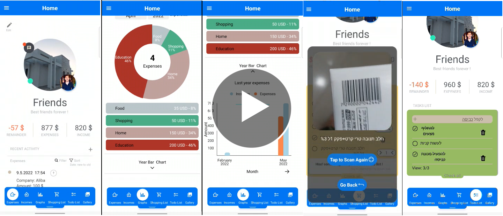

# HomEco :moneybag: :houses: :moneybag:

## 2021 - Final project – HomEco – Home budget management IOS/ Android smartphone aplication.

---

### Technologies:

    
    

### Databases:

### Programming Languages:

    

---

## In the app you will find:

### General user:

1. Register for the system. :pencil:
2. Login to the system.
3. User logout.
4. Password recovery.
5. Creating a home for management. :house:
6. View a list of managed homes. :houses:
7. Main menu for performing actions (drawer navigator - side bar).
8. Personal profile and viewing details. :bust_in_silhouette:
9. Change personal profile information.
10. View personal income.
11. Management (Addition / Removal) Personal Income.
12. Adding pay slips to personal income. :page_facing_up:
13. View income for homes I own.
14. Managing the distribution of income for the homes I own.
15. Currency conversion calculator (using an currency API).
16. Explanation page that includes an E2E video to show the functionality.
17. Option to choose - Receiving optimization proposals for the management of the houses.

### House manager user (including general user + member with all permissions):

18. Adding / removing house partners from a managed home.
19. Management of the permissions of the managed house partners.
20. Changing the details of the house.
21. Deleting a house.
22. Removal of expenses/ incomes of the house. (No matter who creates the expense)

### Home partner user (including general user):

1. Home profile page to view the latest updates.
2. Chat with family partners.
3. Send a WhatsApp message to one of the partners of the house.
4. View a synchronized shopping list.
5. Managing a synchronized shopping list (adding / removing / marking products, quantity management). :shopping_cart:
   Adding products to a shopping list using a barcode. (Including quantity increase) :camera:
   barcodes added from a data file of barcodes to a new firestore collection + menual uploads while using the upp + scraping with react-native-cheerio.
6. View the to-do list.
7. Managing a synchronized list of house chores (adding / removing / marking chores). :white_check_mark:

#### • Permission to access the photo gallery:

9. Photo gallery for home.
10. Photo sharing from a photo gallery - (using an API to shorten link to send).

#### • Permission to add / remove expenses:

11. Adding / Removing Expenses (Created by the same user only)
12. Adding the shopping list as an expense to the home after purchase.
13. View the latest house expenses and their main details.
14. Expanding the amount of expenses that shown at the house profile.
15. Extended viewing of expense information.
16. Filter expenses by user / type / schedule type / name / description.
17. Sort expenses by date / price.
18. Expenditure classification automatically (online / clothing and more).
19. Adding a fixed expense according to the timing of the payment. :spiral_calendar:
20. Update expenses.
21. Event reminder / scheduled expenditure. :alarm_clock:
22. Add an images of an invoice for an expense. :receipt:
23. Adding a Warranty / Contract Photo for Expense. :scroll: :black_nib:
24. Reminder for Expired Warranty / Contract of Expenditure
25. Display of the total expenses, income, the remainder and the future remainder of the house.
26. Viewing the rest which is painted in a matching color: red - negative, green - positive.
27. Automatic update of home budget for each new month.
28. View graphs that show data on how the home economy is doing. :chart_with_upwards_trend: :bar_chart:

#### • Permission to update the house income:

29. Viewing House Income.
30. Expanding the amount of incomes presented.
31. Extended view of house income information.
32. Filtering income by user / type of income (fixed / one-time).
33. Sort income by date / amount.
34. Adding / Removing Income to a Home.
35. Editing house income.
36. Get a reminder of house income. :alarm_clock:
